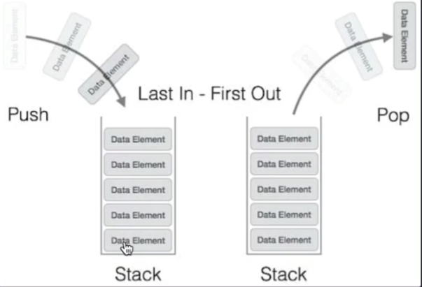
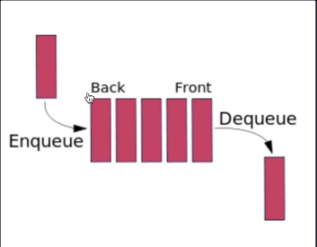

## estrutura de dados

>o que é estrutura de dados?

é uma maneira de organizar e ordenar informações como textos, números, booleanos, etc e registrá-los na memória do computador.

💡imagine um guarda-roupa. o guarda-roupa será a estrutura e as roupas serão os dados.
<br><br>

>desafios diários do uso de dados:
- entendimento de como estão nossos dados na aplicação.
- criar listas (ordernadas, não ordenadas).
- repetição ou nao dos dados dentro da estrutura.
- organizar os dados pelo par identificador + valor.
<br><br>

> gerenciando dados

estrutura de dados tem a ver com a gestão das informações da aplicação,
para esse gerenciamento, podemos dividir em 3 etapas:
1. modelar a estrutura;
2. dar vida á estrutura (instanciar essa estrutura);
3. criar funcionalidades, exemplos: inseir, excluir, buscar, exibir, contar e etc.
<br><br>

> arrays

array ou vetor, é uma estrutura amplamente utilizada e implementada em quase todas as linguagens de programação e também é uma das estruturas mais básicas e simples de criar e utilizar.
<br><br>

```js
['a', 20, 'd', true] // total de 4 elementos
```
<br>

> características do array

- acesso pelo index.
- respeita a ordem de inserção dos elementos (do jeito que eu inserir, ele vai aceitar).
- aceita valores duplicados.
- dependendo do tamanho do array, para encontrar ou deletar um número, será necessário um uso maior de perfomance.
<br><br>

> array no javascript

- são dinamicos.
- você poderá ter dados de diferentes tipos misturados dentro de um array, tipo string, number, boolean, objetos, funções e até outros arrays.
- existem muitos métodos ja implementados. por exemplo: pop(), push(), find(), filter() e etc.
<br>

exemplo de array no código: [aqui](/code//array-methods.js)
<br><br>

> matrix

matrix ou vetor multidimencional, significa que é um array, dentro de outro array, podendo ter vários níveis.

exemplo de matrix no código: [aqui](/code/matrix.js)
<br><br>

> stack

stack significa pilha (linear: um após o outro). stack é uma coleção de elementos organizados de forma que o último elemento adicionado é o primeiro a ser removido, seguindo o princípio "último a entrar, primeiro a sair" (LIFO - Last In, First Out).
<br><br>


<br><br>

> conceitos fundamentais da stack

- push(): adiciona um elemento à pilha.
- pop(): remove o elemento do topo da pilha.
- peek(): obter o elemento do topo da pilha.
- size(): mostrar o tamanho da pilha.

exemplo de stack no código: [aqui](/code/stack.js)
<br><br>

> queue

queue significa fila (linear: um após o outro). queue é uma coleção ordenada de elementos onde a inserção ocorre no final da fila e a remoção ocorre no início da fila, seguindo o princípio "primeiro a entrar, primeiro a sair" (FIFO - First In, First Out).
<br><br>


<br><br>

> conceitos fundamentais do queue:

front (frente) é a referência do primeiro a entrar na fila. <br>
back (fundo) é a referência do último elemento a entrar na fila.

enqueue: significa que está entrando na fila.<br>
dequeue: significa que está saindo da fila.
<br><br>

> queue no código

métodos fundamentais:

- enqueue(): adicinar um elemento ao final da fila.
- dequeue(): remover o primeiro elemento a entrar na fila.
- front(): pega o primeiro elemento da fila.

exemplo do queue no código: [aqui](/code/queue.js)
<br><br>